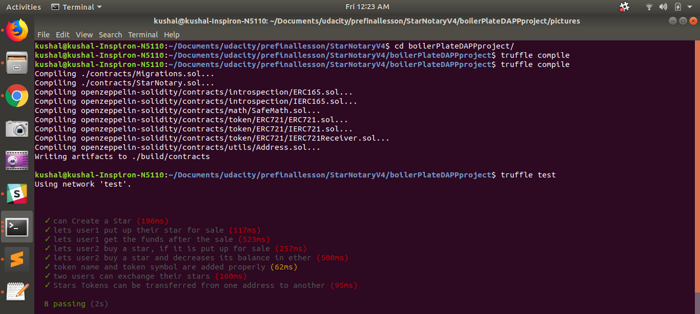
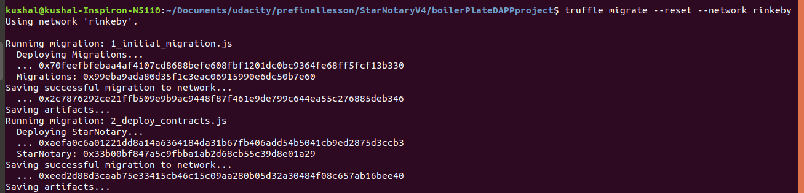
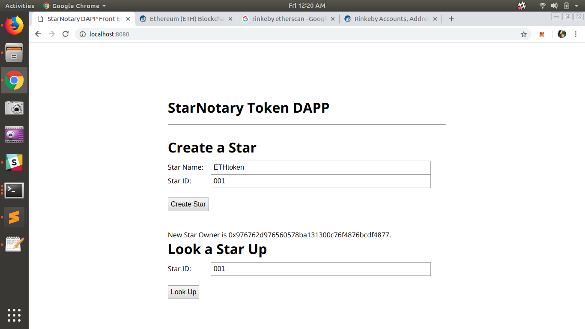

# Decentralized Star Notary Service - Starter Code
- ERC721 based project. ERC721 is Non Fungible token. 

# Token Name
- kushalCoin

# Token Symbol
- KC

# **Token Address** on the Rinkeby Network
- https://rinkeby.etherscan.io/address/0x33b00bf847a5c9fbba1ab2d68cb55c39d8e01a29

# Project Task 1 Completion
- Developing the smart contract 

# Project Task 2 Completion
- Add supporting unit tests, to test the following
 

# Project Task 3 Completion
- Deploy your Contract to Rinkeby

# Project Task 4 Completion
- Modify the front end of the DAPP to achieve the following

